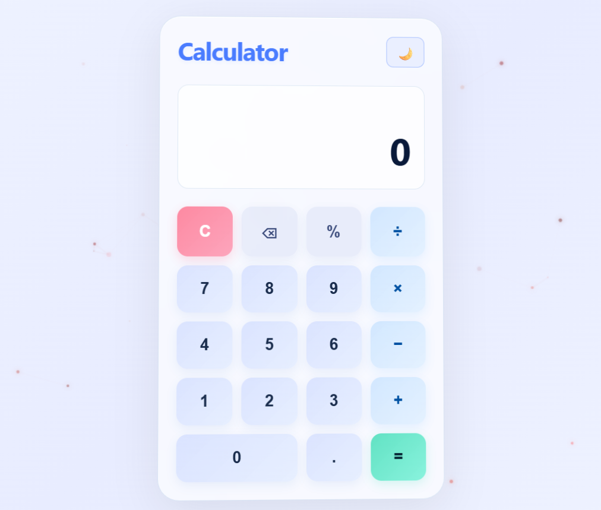
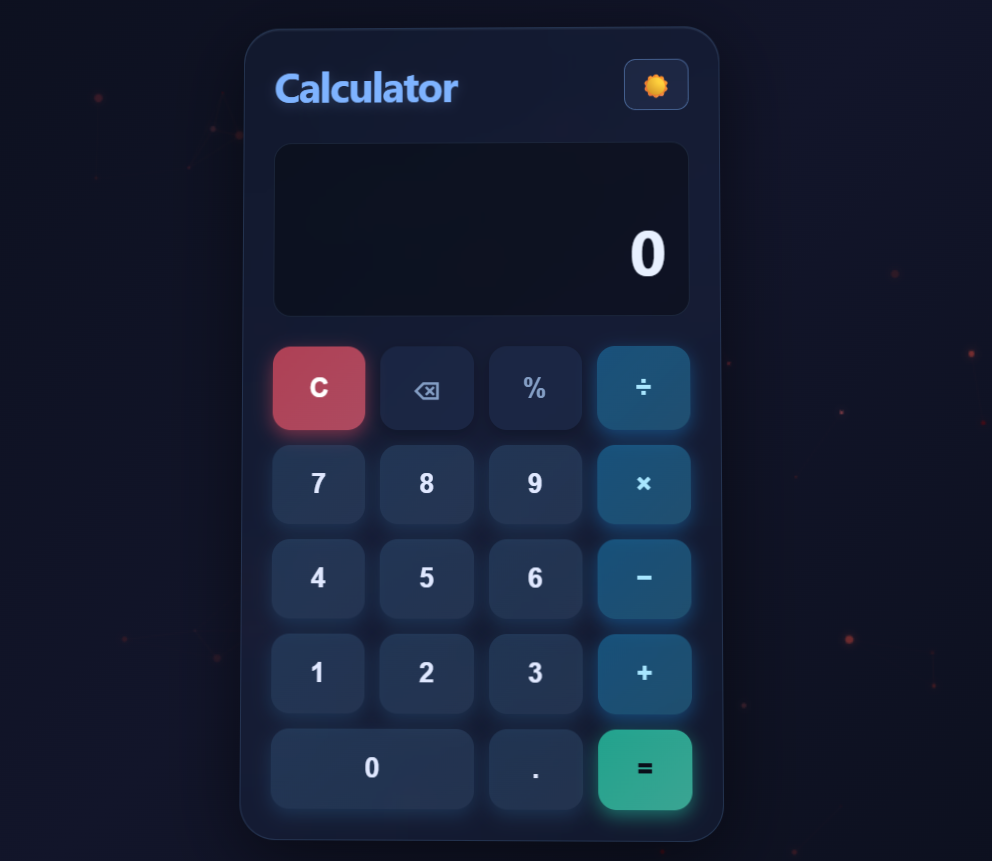

# Simple Calculator

A clean and responsive calculator built using **HTML, CSS, and JavaScript**.

## Live Demo
##  Preview

<p align="center">
  
  
</p>

<p align="center">
  <a href="https://sudeep1425.github.io/Simple-Calculator/">Live Demo</a>
</p>
👉 https://sudeep1425.github.io/Simple-Calculator/

##  Features

* Basic arithmetic operations (+, −, ×, ÷)
* Light & Dark mode
* Responsive design
* Simple and user-friendly UI

## Technologies Used

* HTML
* CSS
* JavaScript

##  Project Structure

```
Simple-Calculator/
│── index.html
│── light.css
│── dark.css
│── script.js
```

##  How to Run Locally

1. Download or clone the repository
2. Open `index.html` in your browser

## Preview

(Add screenshot here later if you want)

##  Author

* Sudeep

---
 If you like this project, consider giving it a star!
